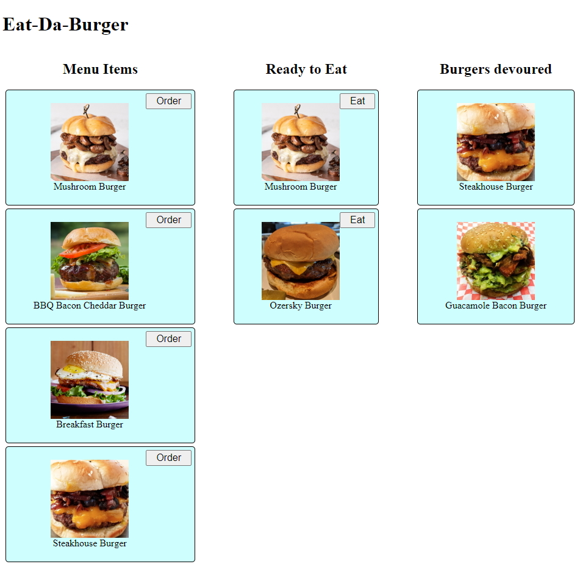

# Restaurant
[](https://opensource.org/licenses/ISC)

[Live Site - https://zar-burger.herokuapp.com/](https://zar-burger.herokuapp.com/)

## Description
A node.js based Express and Postgres app to track a customer's order through the resturant. The client can order from the menu or create a custom burger.



## Table of Contents

1. [Installation](#1-installation)
2. [Usage](#2-usage)
3. [License](#3-license)
4. [Contributing](#4-contributing)
6. [Questions](#5-questions)

## 1 Installation
1. Download repository
	```
	HTTPS: Git clone https://github.com/Zarlengo/Restaurant-App.git
    SSH: Git clone git@github.com:Zarlengo/Restaurant-App.git
	```

2. Install dependencies
	```
	npm install
	```

3. Add table `burgers_db` to your local postgres server

4. Start the server
    ```
    npm run start
    ```

5. Navigate to localhost:8080
    [Server listening on: http://localhost:8080](http://localhost:8080)

## 2 Usage


* Menu Items
    * Choose from any item on the menu and order to prepare the meal
    * Custom orders can be accomidated with entering in the description in the `Order a custom burger` input

* Ready to Eat
    When you're ready to eat the burger, press the `Eat` button to consume it.

* Burgers Devoured
    Consumed burgers reside here

## 3 License
    Copyright © 2020 Chris Zarlengo
    Permission to use, copy, modify, and/or distribute this software for any
    purpose with or without fee is hereby granted, provided that the above
    copyright notice and this permission notice appear in all copies.

    THE SOFTWARE IS PROVIDED "AS IS" AND THE AUTHOR DISCLAIMS ALL WARRANTIES
    WITH REGARD TO THIS SOFTWARE INCLUDING ALL IMPLIED WARRANTIES OF
    MERCHANTABILITY AND FITNESS. IN NO EVENT SHALL THE AUTHOR BE LIABLE FOR ANY
    SPECIAL, DIRECT, INDIRECT, OR CONSEQUENTIAL DAMAGES OR ANY DAMAGES
    WHATSOEVER RESULTING FROM LOSS OF USE, DATA OR PROFITS, WHETHER IN AN ACTION
    OF CONTRACT, NEGLIGENCE OR OTHER TORTIOUS ACTION, ARISING OUT OF OR IN
    CONNECTION WITH THE USE OR PERFORMANCE OF THIS SOFTWARE.

## 4 Contributing
* [Zarlengo](https://github.com/Zarlengo)

## 5 Questions
* [Github Profile for Zarlengo](https://github.com/Zarlengo)
* [Send email to christopher@zarlengo.net](mailto:christopher@zarlengo.net)
* [File an issue](https://github.com/Zarlengo/Restaurant-App/issues)
